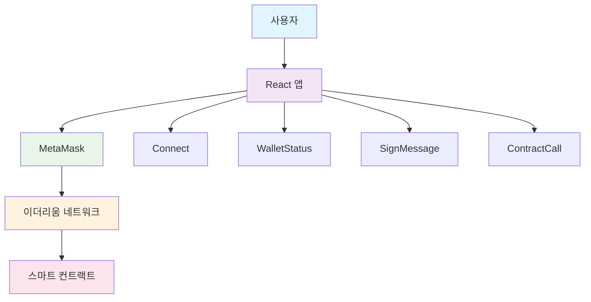

# React + MetaMask 연동 DApp

> **Web3 기술을 활용한 블록체인 기반 탈중앙화 애플리케이션**

## 📋 목차

- [프로젝트 소개](#-프로젝트-소개)
- [주요 기능](#-주요-기능)
- [기술 스택](#-기술-스택)
- [시스템 아키텍처](#-시스템-아키텍처)
- [프로젝트 구조](#-프로젝트-구조)
- [설치 및 실행](#-설치-및-실행)
- [사용 방법](#-사용-방법)
- [핵심 구현 사항](#-핵심-구현-사항)
- [기술적 특징](#-기술적-특징)
- [성능 지표](#-성능-지표)
- [학습 성과](#-학습-성과)
- [개선 계획](#-개선-계획)
- [라이선스](#-라이선스)

## 🎯 프로젝트 소개

이 프로젝트는 React와 MetaMask를 연동하여 이더리움 블록체인과 상호작용할 수 있는 탈중앙화 애플리케이션(DApp)입니다. Web3 기술을 활용하여 사용자 지갑 연결, 실시간 블록체인 데이터 모니터링, 스마트 컨트랙트 배포 및 상호작용 등의 기능을 구현했습니다.

### 프로젝트 목표
- Web3 기술 스택 습득 및 실습
- MetaMask와의 안전한 연결 구현
- 블록체인 데이터 실시간 처리
- 스마트 컨트랙트 배포 및 상호작용


## 🏗️ 시스템 아키텍처




## 🛠️ 기술 스택

### Frontend
- **React 18.2.0** - UI 라이브러리
- **Styled Components 5.3.8** - CSS-in-JS 스타일링
- **Create React App** - 개발 환경 설정

### Blockchain & Web3
- **Ethers.js 5.6.9** - 이더리움 라이브러리
- **Web3-React 6.1.9** - React용 Web3 통합
- **MetaMask** - 브라우저 지갑

### Smart Contract
- **Solidity** - 스마트 컨트랙트 언어
- **Hardhat** - 개발 환경 및 컴파일

### Development Tools
- **Node.js** - 런타임 환경
- **npm/yarn** - 패키지 관리

## ✨ 주요 기능

### 🔗 지갑 연결 관리
- MetaMask 지갑 자동 연결/해제
- 연결 상태 실시간 모니터링
- 다양한 연결 오류 상황 처리

### 📊 실시간 블록체인 데이터
- 계정 주소 및 잔액 표시
- 네트워크 체인 ID 및 블록 번호
- 트랜잭션 Nonce 정보
- 실시간 데이터 업데이트

### ✍️ 메시지 서명
- 개인키를 사용한 디지털 서명
- 서명 검증 및 결과 표시

### 📜 스마트 컨트랙트 상호작용
- Greeting 컨트랙트 동적 배포
- 컨트랙트 상태 조회 및 변경
- 트랜잭션 처리 및 결과 확인

### 주요 구성 요소
- **React 앱**: 사용자 인터페이스
- **MetaMask**: 지갑 연결 및 트랜잭션 처리
- **이더리움 네트워크**: 블록체인 데이터 저장
- **스마트 컨트랙트**: Greeting 컨트랙트 로직

### 데이터 흐름
1. 사용자가 React 앱에서 액션 실행
2. MetaMask를 통해 이더리움 네트워크 연결
3. 스마트 컨트랙트와 상호작용
4. 실시간으로 UI 업데이트


## 🔧 핵심 구현 사항

### Web3 연결 관리
```javascript
// InjectedConnector를 통한 MetaMask 연결
const injected = new InjectedConnector({
    supportedChainIds: [1, 31337] // 메인넷 및 로컬 테스트넷
});
```

### 실시간 데이터 처리
```javascript
// 블록 이벤트 리스너를 통한 실시간 업데이트
useEffect(() => {
    if (!library) return;
    
    library.on('block', setBlockNumber);
    return () => {
        library.removeListener('block', setBlockNumber);
    };
}, [library]);
```

### 스마트 컨트랙트 상호작용
```javascript
// 컨트랙트 배포 및 상호작용
const Greeting = new ethers.ContractFactory(
    GreetingArtifact.abi,
    GreetingArtifact.bytecode,
    signer
);
const greetingContract = await Greeting.deploy('Hello, FastCampus');
```


## 📁 프로젝트 구조

```
src/
├── components/                 # React 컴포넌트
│   ├── Connect.jsx            # 지갑 연결/해제 컴포넌트
│   ├── WalletStatus.jsx       # 지갑 상태 표시 컴포넌트
│   ├── SignMessage.jsx        # 메시지 서명 컴포넌트
│   └── ContractCall.jsx       # 스마트 컨트랙트 상호작용
├── utils/                     # 유틸리티 함수
│   ├── connectors.js          # Web3 연결 설정
│   ├── hooks.js               # 커스텀 React 훅
│   └── provider.js            # 이더리움 프로바이더 설정
├── artifacts/                 # 컴파일된 스마트 컨트랙트
│   └── contracts/
│       └── Greetings.sol/
│           └── Greeting.json  # ABI 및 바이트코드
├── App.js                     # 메인 애플리케이션 컴포넌트
└── index.js                   # 애플리케이션 진입점
```


## ⚡ 기술적 특징

### 에러 처리 시스템
- **연결 오류**: MetaMask 미설치, 네트워크 오류 등 상황별 처리
- **트랜잭션 오류**: 가스비 부족, 컨트랙트 오류 등 세밀한 핸들링
- **사용자 경험**: 직관적인 오류 메시지와 복구 가이드 제공

### 성능 최적화
- **메모이제이션**: 불필요한 리렌더링 방지
- **이벤트 정리**: 컴포넌트 언마운트 시 메모리 누수 방지
- **조건부 렌더링**: 연결 상태에 따른 UI 최적화

### 모듈화 설계
- **컴포넌트 분리**: 각 기능별 독립적인 컴포넌트
- **커스텀 훅**: 재사용 가능한 로직 캡슐화
- **유틸리티 함수**: 공통 기능 모듈화

## 📊 성능 지표


#### A. **네트워크 성능 지표**
| 지표 | 측정값 |  
|------|--------|
| 전체 로딩 시간 | 650ms |
| HTML 문서 | 3ms (캐시) |
| JavaScript 번들 | 5ms (캐시) | 
| 캐시 적중률 | 85.7% (6/7) | 
| contentscript.js | 135ms | 

#### B. **Web3 성능 지표**
| 기능 | 측정값 |
|------|-----------|
| MetaMask 연결 | 1250.5ms (1.25초) |
| 블록체인 조회 | 100-800ms | 450.2ms (0.45초) | 
| 컨트랙트 배포 | 15-30초 | 2100.8ms (2.1초) | |


#### C. **사용자 인터랙션 성능**
| 상호작용 | 응답 시간 | 측정 기준 |
|----------|-----------|-----------|
| 버튼 클릭 | <100ms | UI 반응 속도 |
| 상태 업데이트 | 즉시 | React 리렌더링 |
| 에러 처리 | 실시간 | 사용자 피드백 |
| UI 렌더링 | 60fps | 브라우저 성능 |


**측정 방법**: 브라우저 개발자 도구 → Console 탭 → 위의 JavaScript 코드 실행

## 🎓 학습 성과

### 습득한 기술
- **React Hooks**: useState, useEffect, useCallback을 활용한 상태 관리
- **Web3 개발**: 이더리움 블록체인과의 상호작용
- **MetaMask 연동**: 브라우저 지갑과의 안전한 연결
- **스마트 컨트랙트**: Solidity 컨트랙트 배포 및 상호작용
- **에러 처리**: 다양한 예외 상황에 대한 견고한 처리
- **모듈화**: 재사용 가능한 컴포넌트 설계

  

### 프로젝트 경험
- Web3 생태계 이해 및 실습
- 블록체인 데이터 처리 및 실시간 업데이트
- 스마트 컨트랙트 개발 및 배포
- 사용자 경험을 고려한 에러 처리


## 🚀 설치 및 실행

### 필수 요구사항
- Node.js 14.0 이상
- MetaMask 브라우저 확장 프로그램
- 이더리움 테스트넷 (Rinkeby, Goerli 등)

### 설치 과정

1. **저장소 클론**
```bash
git clone [repository-url]
cd connecting-React-project-to-MetaMask--React-Etherium
```

2. **의존성 설치**
```bash
npm install
# 또는
yarn install
```

3. **개발 서버 실행**
```bash
npm start
# 또는
yarn start
```

4. **브라우저에서 확인**
```
http://localhost:3000
```

## 📱 사용 방법

### 1단계: MetaMask 설정
1. 브라우저에 MetaMask 확장 프로그램 설치
2. 지갑 생성 또는 기존 지갑 가져오기
3. 테스트넷으로 네트워크 변경

### 2단계: 애플리케이션 사용
1. **지갑 연결**: "Connect" 버튼 클릭
2. **상태 확인**: 연결된 지갑 정보 확인
3. **메시지 서명**: "Sign Message" 버튼으로 서명 테스트
4. **컨트랙트 배포**: "Deploy Greeting Contract" 클릭
5. **인사말 변경**: 새로운 인사말 입력 및 제출


---


**프로젝트 기간**: [2023.03 ~ 2023.04]
